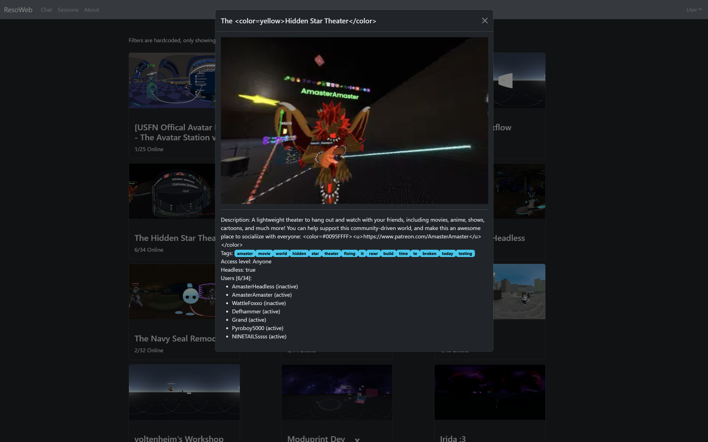

# Reso-WEB

This should be an app to chat and manage inventory and whatnot but for now only parts of chat is implemented and listing sessions with details.



## Features

- Can list users (no status)
- Can fetch an user messages history
- List sessions with 3D sphere viewer and details (sessions list is filtered hard for now for only minUsers=1)

## It's broken :(

Anything using SignalR doesn't work, Sessions Updates are received, but nothing sent seems to be accepted, so no statues at all, sending messages, status refresh etc...

```js
// All .send or .invoke on the SignalR thingy ends up with:
// {"type":3,"invocationId":"4","result":null}
// so idk... but we receive correctly the session updates
// it's just that anything send to it just seems to silently fail

// example:
// TX: {"arguments":[],"invocationId":"0","target":"InitializeStatus","type":1}
// RX: {"type":3,"invocationId":"0","result":null}
// ReCon send:
// {type: 1, invocationId: 38c6f633-ef56-45cc-884c-63577d161b08, target: InitializeStatus, arguments: []}
```
