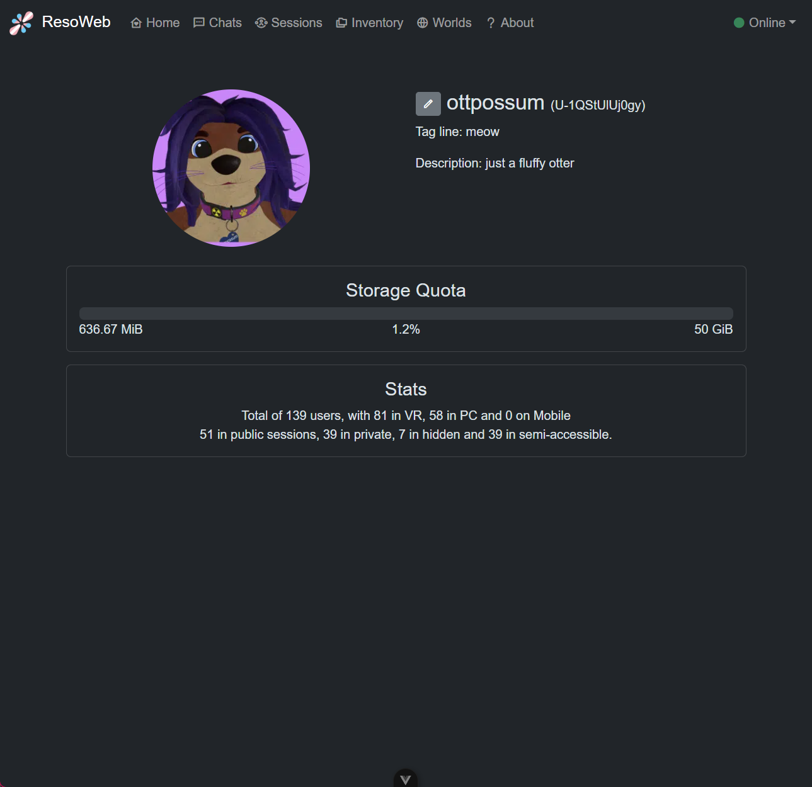

# Reso-WEB

This is an Electron/VueJS app to chat and manage inventory and whatnot for resonite.

Note: the app is still a bit glitchy mostly due to the rate limiting, and probably the fact that we can't do real websockets (you can't set custom headers for websockets in the browser) :(

## Features

- User profile
  - Shows (and can edit) your tagline and description
  - Shows your profile picture and UserID
  - Shows your inventory usage (used, total, percent)
  - Shows various game stats (users in VR, desktop, session types)
- Chats
  - Can send and receive messages, with realtime updates.
  - Can also listen to audio message and view Session invites and Request.
  - Can broadcast your own status (not tested if that really works yet tho :p)
- Inventory
  - Basic browsing, and getting `resdb:///` link of objects.
- Sessions
  - Listing of sessions with text formatting
  - Session details with users, 3D Sphere Viewer, master, etc.
  - `go.resonite.com` and `ressession:///` links
- Worlds
  - Listing of worlds and filtering
  - Show detail of worlds with 3D Sphere Viewer, update times, etc.

## TODO / Unsupported

- User profile
  - Set profile picture
- Chats
  - Handle `Object` messages
  - Sending `Audio` messages
  - Showing in which world the contact is
  - Mark messages as read
  - Add contact
  - Remove contact
  - Cancel contact add
  - Filter contacts by status
- Inventory
  - Browse public dirs
  - Download asset
  - Upload asset
- Global
  - Notifications (native & inapp)

## Build or something

- git clone
- install nodejs + yarn
- yarn install

- dev:
  - `yarn dev`
- build windows:
  - `yarn run build:win`
- build mac (untested):
  - `yarn run build:mac`
- build linux (untested):
  - `yarn run build:linux`

## Special mention

To Resonite for not having any CORS to permits us to make apps from the browser :| https://github.com/Yellow-Dog-Man/Resonite-Issues/issues/3537

So the whole APIs are usable only through a custom proxy, a full-native (non-browser) app, or with electron web security disabled, yay,,,
